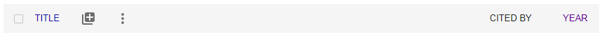
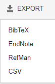
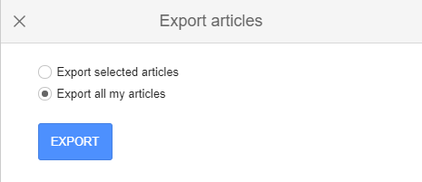
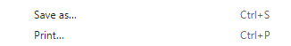
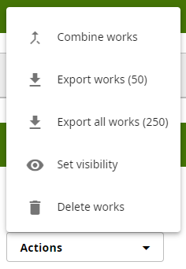

# CompareReferences
Compare References from two different sources.

# Why?

We often need to compare references from two different sources to make sure we are upto
date. This is trivial and annoying, until you get a couple of hundred references!

Here is a simple python applet to compare the references for you. 

# How?

In this example, we will compare references from Google Scholar and ORCID. However, 
you are not limited to those two services, you can use anything, you just need to
download the references as `bibtex` format files, which is a widely used
reference format.

## Step 1. Download your Google Scholar references
1. Log into your Google Account and head to [Google Scholar](https://scholar.google.com/)
2. Check the box in the toolbar shown below. This activates a "hidden" menu: 

3. The new menu will appear: 

4. Choose `EXPORT` and then select `BIBTEX` from the pulldown options: 

5. Choose `Export all my articles` from the menu, and then click the export button: 

6. On the next page, right click and choose `Save As`: 

7. Save this as a file somewhere you will remember!

## Step 2. Download your ORCID references
1. Log into your [ORC-ID](https://orcid.org/) page
2. Scroll down until you see `Works`: 

3. Check the box next to `Select All`: 

4. Choose `Export all works` from the `Actions` pop up menu: 

5. And then choose `Export selected works to BibTex` from the bottom of the next page: 

6. This will download a file, which by default is called `works.bib`

