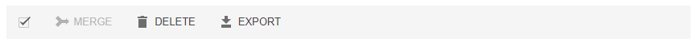
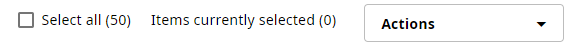
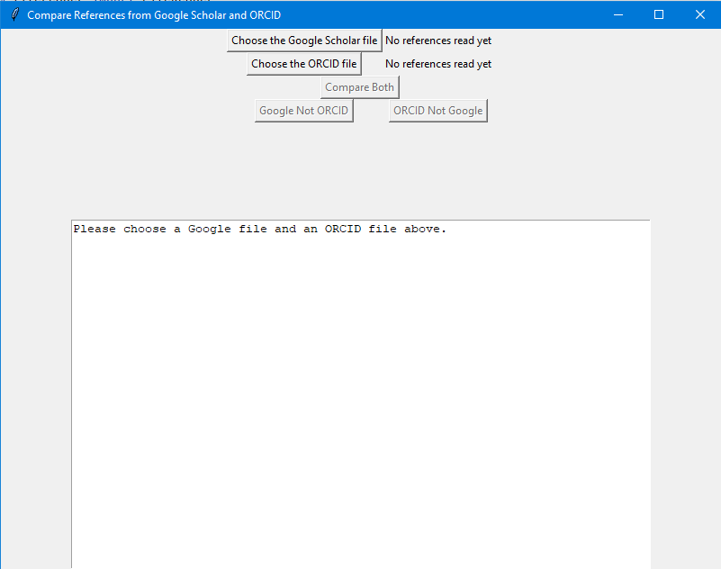
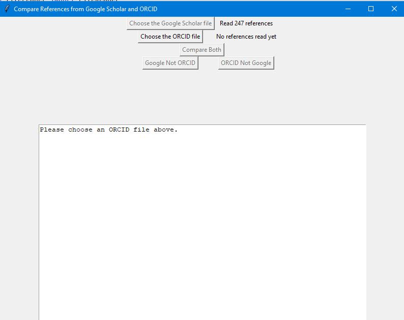
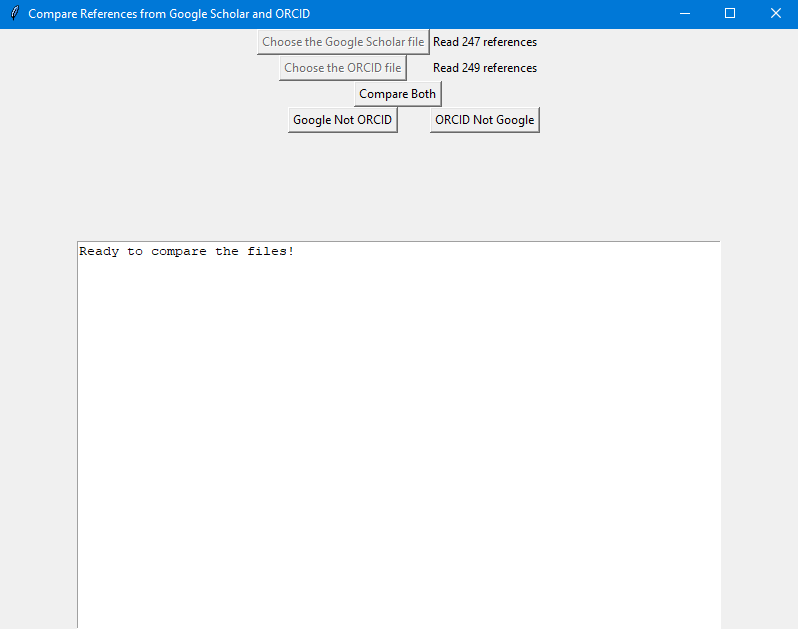

[](https://edwards.sdsu.edu/research)
[](https://www.zenodo.org/badge/latestdoi/440388622)
[](https://opensource.org/licenses/MIT)


# CompareReferences
Compare References from two different sources.

# Why?

We often need to compare references from two different sources to make sure we are upto
date. This is trivial and annoying, until you get a couple of hundred references!

Here is a simple python applet to compare the references for you. 


# How?

In this example, we will compare references from Google Scholar and ORCID. However, 
you are not limited to those two services, you can use anything, you just need to
download the references as `bibtex` format files, which is a widely used
reference format.

## Step 1. Download your Google Scholar references
1. Log into your Google Account and head to [Google Scholar](https://scholar.google.com/)
2. Check the box in the toolbar shown below. This activates a "hidden" menu:<br />
[](https://scholar.google.com)
3. The new menu will appear:<br />
[](https://scholar.google.com/)
4. Choose `EXPORT` and then select `BIBTEX` from the pulldown options:<br />

5. Choose `Export all my articles` from the menu, and then click the export button:<br />

6. On the next page, right click and choose `Save As`:<br />

7. Save this as a file somewhere you will remember!

## Step 2. Download your ORCID references
1. Log into your [ORC-ID](https://orcid.org/) page
2. Scroll down until you see `Works`:<br />

3. Check the box next to `Select All`:<br />

4. Choose `Export all works` from the `Actions` pop up menu:<br />

5. And then choose `Export selected works to BibTex` from the bottom of the next page:<br />

6. This will download a file, which by default is called `works.bib`

## Compare the References

You can either download and run the executable, or download this Git repository
and install the modules.

### Use the prebuilt executable

This is the easiest way, just download the appropriate executable and use it!

### Use the repository

This is the safest way, because you can see the code you are running!

To download the repository follow these simple steps:

```bash
git clone https://github.com/linsalrob/CompareReferences.git
cd CompareReferences
python3.9 -m venv venv
source venv/bin/activate
pip install -r requirements.txt
python3 src/CompareReferences.py 
```

Either way, you will have the window open to read Google Scholar and ORCID files.

1. Read your Google Scholar file. Choose read Google Scholar from the top menu:<br />

2. Once you have read that, the button will be inactive and you will see how many references were read from that file.
Click on the Read ORCID file to do the same for ORCID:<br />

3. Once you have read both files, you will see the number of references in each and the
comparison buttons will be available:<br />


   1. `Compare Both` lists references unique to Google and then references in ORCID
   2. `Google Not ORCID` lists the references unique to Google
   3. `ORCID Not Google` lists the references unique to ORCID
4. You can copy and paste the references, or edit them in this text box 